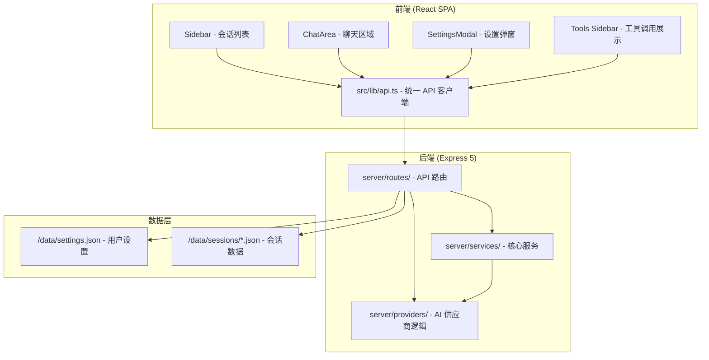

# AI Math & Chat Studio

一款专注于对话体验的多会话 AI 聊天应用。支持多种 AI 供应商接入以及丰富的数学公式渲染能力。

## 核心特性

### 🤖 多供应商 AI 支持

- **Google Gemini** - 原生 Function Calling 支持
- **Nvidia NIM** - 低性能但是免费模型推理
- **OpenAI 兼容 API** - 支持任意 OpenAI 格式 API 端点

### 📐 Provider + Model + Character 分离架构

- **Providers Tab**：配置 API 连接信息（Base URL、API Key、环境变量）
- **Models Tab**：配置模型参数（temperature、maxTokens、推理努力程度等）
- **Characters Tab**：创建/管理角色（系统提示词），轻松切换不同的 AI 人格
- **快捷切换浮动栏**：在输入框上方快速切换当前活跃模型和角色
- 支持同一供应商下多个模型实例
- 支持远程模型列表自动同步

### 🧙‍♂️ 角色系统

- **灵活角色管理**：在设置中创建多个角色，每个角色配备独享的系统提示词
- **会话级角色标记**：每个会话记录创建时使用的角色，后续方便追溯
- **快捷切换**：输入框上方浮动栏一键切换当前活跃角色
- **角色名称显示**：会话标题处以小字标注当前角色，方便区分不同人格的对话

### 📈 数学公式渲染

- **KaTeX** 渲染 - 支持行内 `$...$` 和块级 `$$...$$`
- **mhchem** 扩展 - 支持化学公式 `\ce{H2O}`
- 自动转换 `\[...\]` 和 `\(...\)` 为标准 KaTeX 格式

### 🚀 SSE 流式响应

- 实时显示 AI 生成过程
- 支持思考过程展示（可折叠/展开）

### 🔄 消息操作

- **Retry（重试）**: 从当前消息往前找到最近的用户消息，抛弃其后所有内容重新生成
- **Continue（继续）**: 在当前会话末尾添加指令，让 AI 继续被中断的输出（适用于网络错误/流中断场景）
- **Regenerate（重新生成）**: 针对模型回复，保留其思考过程，抛弃正文，让 AI 基于原有思考继续输出（适用于深化分析、修正输出）


### 📥 数据导出

- **Claude 格式导出**：支持将所有会话导出为 Claude 官方 `conversations.json` 格式，兼容第三方工具
- **Markdown 导出**：支持将会话导出为纯文本 Markdown 格式
### 💡 后端驱动架构

- **GenerationManager** 管理生成任务生命周期
- 前端关闭不影响后端继续生成
- 页面刷新后自动恢复生成状态
- 支持取消正在进行的生成请求

### 📁 数据持久化

- 本地 JSON 文件存储（无需外部数据库）
- `/data/settings.json` - 用户设置
- `/data/sessions/*.json` - 会话数据
- 支持导出聊天记录为 Markdown

警告：不要把可能导致安全问题的密钥写入 `settings.json` 并推送到远程！

## 技术栈

### 前端

| 技术                    | 版本    |
| ----------------------- | ------- |
| React                   | ^19.2.7 |
| TypeScript              | ~6.0.3  |
| Vite                    | ^8.0.16 |
| Tailwind CSS            | ^4.3.1  |
| @tailwindcss/typography | ^0.5.20 |

### 后端

| 技术          | 版本    |
| ------------- | ------- |
| Express       | ^5.2.1  |
| tsx           | ^4.22.4 |
| @google/genai | ^2.8.0  |
| OpenAI SDK    | ^6.44.0 |

### 数学库

| 技术                 | 版本                 |
| -------------------- | -------------------- |
| KaTeX                | ^0.17.0              |
| remark-math          | ^6.0.0               |
| rehype-katex         | ^7.0.1               |
| katex/contrib/mhchem | (bundled with KaTeX) |

### Markdown 渲染

| 技术           | 版本    |
| -------------- | ------- |
| react-markdown | ^10.1.0 |
| remark-gfm     | ^4.0.1  |

## 快速开始

### 环境要求

- Bun

### 安装

```bash
# 克隆项目
git clone <repository-url>
cd ai-math-chat-studio

# 安装依赖
bun install

# 配置环境变量
cp .env.example .env
```

### 配置环境变量

创建 `.env` 文件：

```env
# 至少配置一个 API Key
GEMINI_API_KEY=your_gemini_api_key
NVIDIA_API_KEY=your_nvidia_api_key
OPENAI_API_KEY=your_openai_api_key
```

### 启动开发服务器

```bash
bun run dev
```

访问 <http://localhost:3000>

## 使用指南

### 配置 AI 供应商

1. 点击左侧边栏的 "Settings" 按钮
2. 切换到 **Providers** Tab
3. 点击 "Add Provider"
4. 选择供应商类型（Google / Nvidia / OpenAI Compatible）
5. 填写名称、API Key、Base URL（如需要）
6. 保存

### 配置模型

1. 切换到 **Models** Tab
2. 点击 "Add Model"
3. 选择关联的供应商
4. 填写模型 ID（如 `gemini-2.5-flash`）
5. 配置模型参数（temperature、maxTokens 等）
6. 保存

### 选择活跃模型

1. 切换到 **General** Tab
2. 在 "Active Model" 下拉框中选择模型
3. 保存设置

### 开始聊天

1. 点击 "New Chat" 创建新会话
2. 在输入框中输入消息（支持数学公式）
3. 按 Ctrl+Enter 发送
4. 观看 AI 的实时响应

### 数学公式示例

- 输入包含数学公式的消息，会自动渲染：

    解这个方程：$$x^2 - 4 = 0$$

    计算导数：$d/dx(x^2 + 2x)$

    化学反应：$\ce{2H2 + O2 -> 2H2O}$

## 架构概览



## 项目结构

```tree
ai-math-chat-studio/
├── docs/                       # 项目文档
│   ├── architecture.md           # 架构概览
│   ├── api-providers.md          # AI 供应商集成
│   ├── components.md            # 组件结构
│   ├── data-models.md           # 数据模型
│   ├── tech-stack.md            # 技术栈详情
│   └── file-structure.md         # 文件结构
├── src/
│   ├── App.tsx                  # 主应用组件（状态管理中心）
│   ├── types.ts                 # TypeScript 类型定义
│   ├── components/
│   │   ├── Sidebar.tsx           # 会话列表
│   │   ├── ChatArea.tsx          # 聊天区域
│   │   ├── SettingsModal.tsx     # 设置弹窗
│   │   └── MarkdownRenderer.tsx    # Markdown 渲染
│   └── lib/
│       └── api.ts               # 统一 API 客户端
├── server/
│   ├── app.ts                   # Express 应用组装
│   ├── routes/
│   │   ├── settings.ts          # 设置 API
│   │   ├── sessions.ts          # 会话 API
│   │   ├── chat.ts              # 聊天 API
│   │   └── models.ts            # 模型 API
│   ├── providers/
│   │   ├── built-in.ts         # 内置供应商定义
│   │   ├── config.ts           # 配置解析
│   │   └── stream.ts           # 流式 API 调用
│   └── services/
│       └── generation-manager.ts # 生成任务管理
├── data/                       # 数据存储（不提交）
├── server.ts                   # 入口文件
└── package.json
```

## 开发指南

### 命令

```bash
bun run dev      # 启动开发服务器
bun run build    # 生产构建
bun run lint     # TypeScript 类型检查
bun run clean    # 清除构建目录
```

### 代码规范

- **TypeScript** 项目，所有类型定义在 `src/types.ts`
- **React 函数组件**，不使用 class 组件
- **Tailwind CSS** 样式
- **无外部状态库** - 使用 React `useState` + `useEffect`
- **乐观更新** - 先更新 UI 再持久化到服务端
- **路径别名** - `@/*` 映射到项目根目录

### 添加新的 AI 供应商

方式一：配置 OpenAI 兼容实例（推荐）

1. 打开 Settings → Providers Tab
2. 点击 Add Provider，选择类型 `openai-compatible`
3. 填写名称、Base URL、API Key
4. 在 Models Tab 中添加模型

方式二：添加内置类型（需要修改代码）

1. 修改 `server/providers/built-in.ts`
2. 修改 `server/providers/stream.ts` 添加流式函数
3. 修改 `server/routes/models.ts` 添加模型列表获取逻辑

### 数据模型

```typescript
// ProviderInstance - 供应商实例
interface ProviderInstance {
    id: string;
    type: "google" | "nvidia" | "openai-compatible";
    name: string;
    baseURL?: string;
    apiKey?: string;
    envKey?: string;
    extra?: Record<string, any>;
    modelSource?: string;
}

// ModelInstance - 模型实例
interface ModelInstance {
    id: string;
    providerId: string;
    providerType: "google" | "nvidia" | "openai-compatible";
    modelId: string;
    displayName?: string;
    temperature?: number;
    maxTokens?: number;
    reasoningEffort?: string;
    thinkingLevel?: string;
}

// ChatSession - 聊天会话
interface ChatSession {
    id: string;
    title: string;
    messages: ChatMessage[];
    createdAt: string;
    updatedAt: string;
}
```

## API 端点

### REST API

| 方法   | 端点                           | 描述               |
| ------ | ------------------------------ | ------------------ |
| GET    | `/api/settings`                | 获取用户设置       |
| PUT    | `/api/settings`                | 保存用户设置       |
| GET    | `/api/sessions`                | 获取所有会话       |
| GET    | `/api/sessions/:id`            | 获取单个会话       |
| DELETE | `/api/sessions/:id`            | 删除会话           |
| POST   | `/api/sessions/:id/messages`   | 发送消息           |
| POST   | `/api/sessions/:id/retry`      | 重试消息           |
| POST   | `/api/sessions/:id/regenerate` | 重新生成           |
| POST   | `/api/sessions/:id/continue`   | 继续生成           |
| DELETE | `/api/sessions/:id/generation` | 停止生成           |
| GET    | `/api/providers`               | 获取内置供应商类型 |
| POST   | `/api/providers/:type/models`  | 获取模型列表       |

### SSE 流式端点

| 端点                               | 描述         |
| ---------------------------------- | ------------ |
| `GET /api/sessions/:id/generation` | 订阅生成进度 |

SSE 事件类型：

- `delta` - 内容更新

- `done` - 生成完成
- `error` - 错误
- `stopped` - 已停止

## 文档

详细文档位于 `docs/` 目录：

- [architecture.md](docs/architecture.md) - 架构概览
- [api-providers.md](docs/api-providers.md) - AI 供应商集成
- [components.md](docs/components.md) - 组件结构
- [data-models.md](docs/data-models.md) - 数据模型

- [tech-stack.md](docs/tech-stack.md) - 技术栈详情
- [file-structure.md](docs/file-structure.md) - 文件结构

## 贡献

欢迎提交 Issue 和 Pull Request。请确保：

1. 代码通过 TypeScript 类型检查
2. 修改架构/模型时同步更新 `docs/` 目录下的相关文档
3. 保持代码风格一致

## 许可证

MIT License
