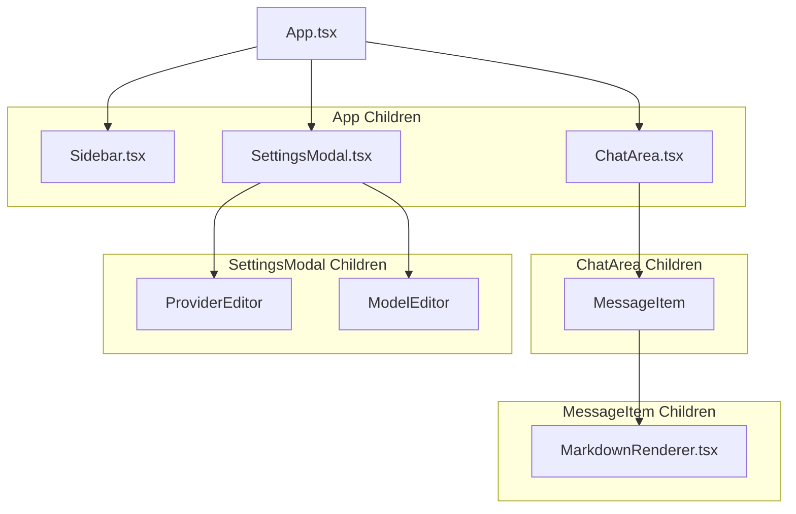

# 组件结构文档

## 组件树

## `App.tsx` — 状态管理中心

**职责**:

*   **状态中心**: 作为整个应用的顶层组件，管理所有核心状态。
*   **数据获取**: 在应用启动时，通过 `api.ts` 从后端获取初始设置和会话数据。
*   **状态管理**: 管理会话列表 (`sessions`)、当前会话 (`currentSessionId`)、用户设置 (`settings`)、以及全局 UI 状态（如 `isSettingsOpen`）。
*   **业务逻辑**: 实现核心业务逻辑，如新建/删除会话、发送/重试消息，并将这些函数作为 props 传递给子组件。
*   **持久化**: 调用 `api.ts` 中的函数将变更（如保存设置、发送消息）持久化到后端。

## `Sidebar.tsx` — 左侧栏

**职责**:

*   **会话列表**: 显示所有聊天会话，按更新时间排序。
*   **分类过滤**: 在会话列表上方提供角色选择器，允许用户按 Character 过滤显示的会话。
*   **加星功能 (Starring)**: 允许用户给每个会话进行加星标记，并提供黄、红、蓝、绿、橙五种预设星星颜色。加星数据保存在 `settings.json` 的 `starredSessions` 映射中。
*   **置顶快速访问 (Starred Sections)**: 当有被加星的会话存在时，在侧边栏最顶端显示一个单独的、可折叠的“已加星会话”分组，保证极高的数据查看和切换效率。
*   **用户交互**: 允许用户切换会话、新建会话、复制会话、删除会话、加星会话。
*   **导航**: 提供打开设置模态框的入口。

## `ChatArea.tsx` — 聊天主区域

**职责**:

*   **消息显示**: 渲染当前会话的消息列表，包括用户消息和 AI 回复。
*   **SSE 订阅**: 这是处理实时响应的核心。它通过 `api.subscribeGeneration` 订阅后端 SSE 端点，并根据接收到的事件 (`delta`, `done`, `error`, `stopped`) 实时更新 `streamingContent` 状态。
*   **输入处理**: 管理用户输入框，支持 `Ctrl+Enter` 发送和 `Shift+Enter` 换行。
*   **交互操作**: 提供停止生成、导出聊天记录等功能。支持手动修改当前会话绑定的 Character（点击标题下方的角色名称）。
*   **快捷选择栏**: 在输入框上方提供浮动栏，允许用户快速切换当前活跃模型和角色。切换后即时保存到 `settings.json`。

### `MessageItem` (子组件)

*   **职责**: 渲染单条消息，包括消息内容、头像、以及操作按钮（复制、查看/全屏预览、重试、重新生成、继续）。
*   **思考过程处理**: 解析并渲染 AI 回复中包含的 `
` 思考过程块，并提供折叠/展开功能。
*   **消息操作**:
    *   **Copy（复制）**: 复制消息的正文内容。
    *   **View（查看）**: 鼠标悬浮时在消息左侧/右侧（按钮改成竖着并排展示以防错位）显示 👁️ 图标按钮。点击后在页面顶层覆盖一个最大化（填充整个可视页面）的 Markdown 渲染结果遮罩层。如果查看/打印的是模型消息，会往上找到最近的一个用户消息并一同在渲染层中进行“问题”与“回答”拼接显示。支持关闭将其隐藏，并且大遮罩页面支持单独滚动、不与底层页面冲突。
    *   **Print（纯净打印）**: 在 Markdown 渲染结果遮罩层中支持 Ctrl+P 或点击“打印”按钮，通过构建隐藏的 blank iframe 传入打印命令来实现纯净打印，不带有任何多余的前端 UI 插曲。如果打印模型消息，将同时打印上面找到并拼接的最近用户消息。
    *   **Retry（重试）**: 从当前消息往前找到最近的 user 消息，抛弃其后所有内容重新生成。
    *   **Regenerate（重新生成）**: 保留当前 model 消息的 thinking process，删除正文，抛弃后续消息，注入 continue 指令让 AI 基于原有思考继续输出。
    *   **Continue（继续）**: 仅对最后一条 model 消息显示，在会话末尾添加 continue 指令让 AI 继续被中断的输出。

## `MarkdownRenderer.tsx` — Markdown 渲染器

**职责**:

*   **Markdown-to-HTML**: 使用 `react-markdown` 将 Markdown 文本安全地转换为 React 组件。
*   **插件管线**: 集成 `remark-*` 和 `rehype-*` 插件生态，以支持 GFM (GitHub Flavored Markdown)、数学公式、化学方程式等高级功能。
*   **数学渲染**: 通过 `remark-math` 和 `rehype-katex` 插件，将 LaTeX 格式的数学公式（`$...$` 和 `$$...$$`）渲染为 HTML 和 CSS。
*   **安全**: 使用 `rehype-sanitize` 清理 HTML，防止 XSS 攻击，同时通过 `rehype-raw` 允许安全的、用于特定功能的 HTML 标签（如 `
`)。

## `SettingsModal.tsx` — 设置弹窗

**职责**: 提供一个集中的界面，让用户管理应用的所有配置。它被设计为一个包含四个选项卡的模态框。

### General Tab

*   **活跃模型选择**: 允许用户从所有已配置的模型中选择一个作为当前聊天使用的模型。
*   **活跃角色预览**: 显示当前激活的角色名称及其系统提示词摘要（角色管理已移至 Characters tab）。
*   **UI 开关**: 控制各种前端显示效果，如自动滚动、是否折叠思考过程等。

### Providers Tab

*   **供应商管理**: 允许用户添加、编辑、删除 AI 供应商实例 (ProviderInstance)。
*   **连接配置**: 在 `ProviderEditor` 子组件中，用户可以配置供应商类型（Google, Nvidia, OpenAI Compatible）、API Key、Base URL 等连接信息。

### Models Tab

*   **模型管理**: 允许用户添加、编辑、删除模型实例 (ModelInstance)。
*   **参数配置**: 在 `ModelEditor` 子组件中，用户可以将一个模型绑定到一个供应商，并配置其特定参数，如模型 ID、Temperature、Max Tokens 等。

*   **危险区域操作**:
    *   **Claude 格式导出**: 将所有会话数据转换为符合 Claude 官方规范的 JSON 格式并下载，自动处理思考过程块和时间戳精度。
    *   **强制清洗数据**: 移除数据中的废弃字段，保持数据整洁。

### Characters Tab

*   **角色管理**: 允许用户添加、编辑、删除角色 (Character)。每个角色包含名称和系统提示词。
*   **系统提示词迁移**: 原有 `systemPrompt` 字段被迁移为默认角色。后端生成时优先使用 `activeCharacterId` 对应的角色的 `systemPrompt`，若不存在则回退到 `systemPrompt` 字段。
